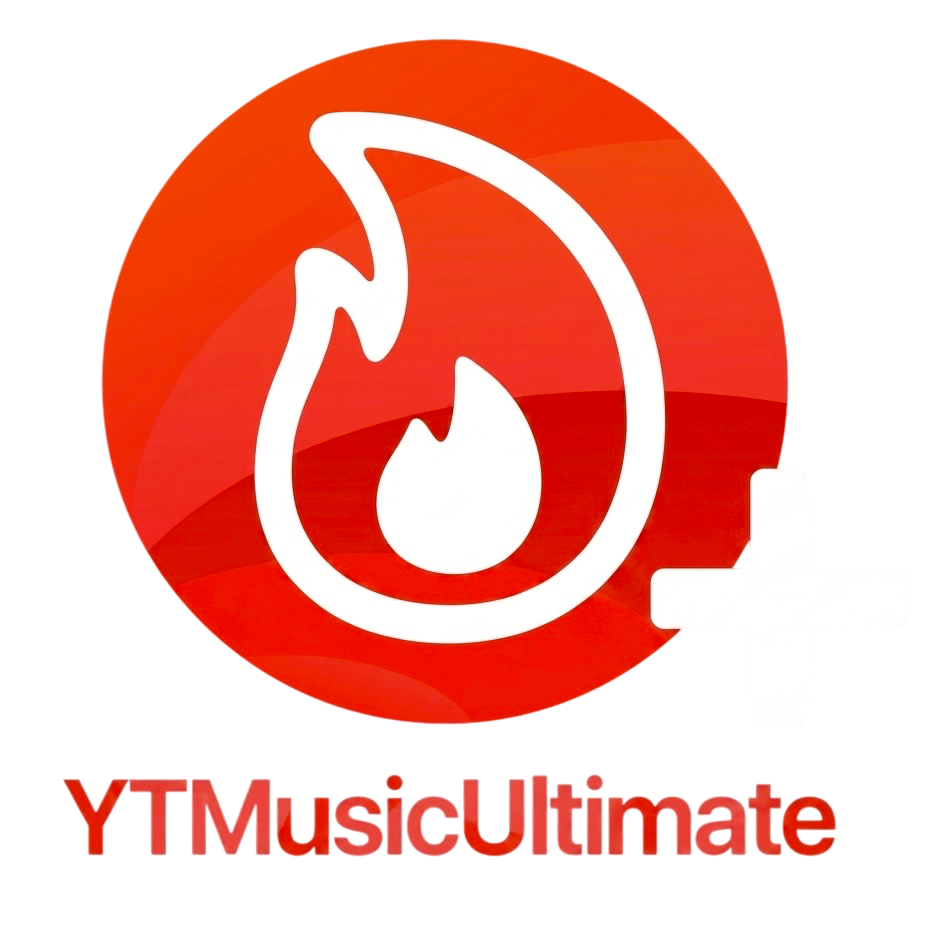

[YTMU+Latest]: https://github.com/Mark02-2012/YTMUltimatePLUS/releases/download/YTMU%2B_9.22.2_2.4.1/YTMUltimate+_2.4.1_9.22.2.ipa
[YTMUlatest]: https://github.com/Mark02-2012/YTMUltimatePLUS/releases/download/YTMU_9.22.2_2.4.1/YTMusicUltimate_9.22.2_2.4.1.ipa
[YTMU+Downloads]: https://github.com/Mark02-2012/YTMUltimatePLUS/releases/download/YTMU%2B_9.14_2.4.1/YTMUltimate+_2.4.1_9.14.2.ipa
[YTMUDownloads]: https://github.com/Mark02-2012/YTMUltimatePLUS/releases/download/YTMU_2.4.1_YTM_9.14/YTMusicUltimate.2.4.1.and.9.14.ipa

# YTMUltimate+

<td>

The best fork of YTMusicUltimate that adds more tweaks for the YouTube Music app on iOS.

<strong>The updates will be released every new YTMusic/YTMusicUltimate version (stimated time for updates: 3-24 hours *VARIABLE*)</strong>

## ⚠️REWRITE IN PROCESS⚠️
**GitHub Actions may not work properly, so please for now don't use it**

## Download table

| Release | YTM version | YTMUltimate version | YTMUltimate+ version |
| :--- | :---: | :---: | :---: |
| [YTMUltimate+ Latest][YTMU+Latest] | 9.22.2 | 2.4.1 | 1.0 |
| [YTMusicUltimate Latest][YTMULatest] | 9.22.2 | 2.4.1 | / |
| [YTMUltimate+ with functioning downloads][YTMU+Downloads] | 9.14.2 | 2.4.1 | 1.0 |
| [YTMusicUltimate with functioning downloads][YTMUDownloads] | 9.14.2 | 2.4.1 | / |

## Download Links

* **Jailbreak:**
Add __[https://ginsu.dev/repo](https://ginsu.dev/repo)__ to your favorite installer and download latest version from there, or from __[Releases](https://github.com/ginsudev/YTMusicUltimate/releases)__ page.

(arm.deb version for Rootful and arm64.deb version for Rootless devices)

* **Sideloading:**
  You can find pre-built IPAs in the [Download table](#download-table) and the [releases tab](https://github.com/Mark02-2012/YTMusicUltimate/releases), but can also build one yourself, keep reading:

## How to build a YTMusicUltimate and YTMUltimate+ IPA by yourself using Github actions

If this is your first time here, start from step 1. If you built a YTMU IPA before, skip steps 1 and 2. Instead, click on the "Sync fork" button to get the latest version of the tweak and continue through step 3.

1. Fork this repository using the fork button on the top right.
2. On your forked repository, go to Repository Settings > Actions, enable Read and Write permissions.
3. Go to the Actions tab on your forked repo, click on "Build and Release YTMusicUltimate" located on the left side. Click "Run workflow" button located on the right side.
4. Find a decrypted YTMusic .ipa file (we cannot provide you this due to legal reasons) and upload it to a file provider (filebin.net, Dropbox or catbox.moe is recommended). Paste the url to the necessary field and click "Run workflow".
5. Wait for the build to finish. You can download the tweaked IPA from the releases section of your forked repo. (If you can't find the releases section, go to your forked repo and add /releases to the url. i.e github.com/user/YTMusicUltimate/releases)

## IPA building troubleshooting (I can't build the IPA/Github action fails/I can't find the releases section etc.)

99.9% of the time, the culprit is the IPA URL you provided. You HAVE TO provide a decryped IPA. It cannot be any other extension, it has to be a **.ipa** file. Find a decrypted YTMusic IPA(we can't help you with that), upload it to filebin.net or Dropbox, give the direct link to the GitHub action. If you find a working ipa and upload it properly, everything will start working perfectly, pinky promise.

If the github action works and you cannot find where you can download the result, you need to add /releases to the url of your forked repository. It'll probably look like this: https://github.com/YOURUSERNAME/YTMusicUltimate/releases, don't forget to replace the YOURUSERNAME part with your username. It may seem invisible but if the github action is successful, IPA will be there.

## How to build the package by yourself on your device
1. Install __[Theos](https://theos.dev/docs/installation)__
2. Clone this repo __[using git](https://docs.github.com/en/repositories/creating-and-managing-repositories/cloning-a-repository)__
3. Cd your YTMusicUltimate folder and run:

   • '**make clean package**' to build deb for rootful device
   
   • '**make clean package ROOTLESS=1**' to build deb for rootless device
   
   • '**make clean package SIDELOADING=1**' to build deb for injecting in to ipa

   • To learn how to inject tweaks in to ipa visit __[here (Azule)](https://github.com/Al4ise/Azule)__

## So.. What is YTMUltimate+?
YTMUltimate+ is simply a fork of the original [YTMusicUltimate](https://github.com/Dayanch96/YTMusicUltimate) by [Dayanch96](https://github.com/Dayanch96), but with more integrated tweaks.

## YTMUltimate+ versions changelog
 * **1.0 (May 29 2026)**:
  
First release, added Return-YouTube-Music-Dislikes, YTMABConfig, YouMusicPiP and VolumeBoostYT

## Added tweaks
* **MUST READ**
  
All added tweaks preferences can be found in YTMusic > Account > Settings, except for VolumeBoostYT and YouMusicPiP; YTMusicUltimate preferences can be found in YTMusic > Account.

  
 

  
Return-YouTube-Music-Dislikes

   
Return-YouTube-Music-Dislikes is a tweak based on Return-YouTube-Dislikes that permit to view dislikes in YouTube Music app

     
<a href="https://github.com/PoomSmart/Return-YouTube-Music-Dislikes">Official repository</a> by <a href="https://github.com/PoomSmart">PoomSmart</a>

   

  

   
YTMABConfig

    
YTMABConfig is a tweak that permit to view and change A/B flags of YouTube Music

     
<a href="https://github.com/PoomSmart/YTMABConfig">Official repository</a> by <a href="https://github.com/PoomSmart">PoomSmart</a>

  

  

   
YouMusicPiP

   
YouMusicPiP is a tweak based on YouPiP that enable PiP in YouTube Music when you select video mode on the song and exit from the app

     
<a href="https://github.com/PoomSmart/YouMusicPiP">Official repository</a> by <a href="https://github.com/PoomSmart">PoomSmart</a>

  

   

     
VolumeBoostYT

     
VolumeBoostYT is a tweak that was created for YouTube, but it's also compatible with YouTube Music, that permit to adjust and boost your volume from 0 to 2000% with gestures

     
<a href="https://github.com/VasirakCalgux/VolumeBoostYT">Official repository</a> by <a href="https://github.com/VasirakCalgux">VasirakCalgux</a>

   

